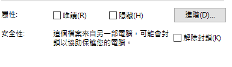

### 簡介

Windows Portable Executable (PE) and Common Object File Format (COFF) files 檔案格式

- PE32 表示 X86 32bit 機器
- PE32+ 表示 X86-64 64bit 機器

### [PE Format](https://learn.microsoft.com/en-us/windows/win32/debug/pe-format)

官方完整格式說明

- 一定由 DOS Header 開始，開頭前兩個 byte 為 0x4D4A
- NT Headers

```c
typedef struct _IMAGE_NT_HEADERS64 {
    DWORD Signature; // PE 簽名
    IMAGE_FILE_HEADER FileHeader;
    IMAGE_OPTIONAL_HEADER64 OptionalHeader;
} IMAGE_NT_HEADERS64, *PIMAGE_NT_HEADERS64;
```

64 和 32 位元的 OptionalHeader 結構不一樣

- FileHeade

```c
 typedef struct _IMAGE_FILE_HEADER {
  WORD    Machine;                       // 平台，intel 386 為 0x014c，intel 64 為 0x0200
  WORD    NumberOfSections;              // Section 數量，最多 96 個字節
  DWORD   TimeDateStamp;                 // 編譯日期
  DWORD   PointerToSymbolTable;
  DWORD   NumberOfSymbols;
  WORD    SizeOfOptionalHeader;          // OptionalHeader 大小, 32 位通常為 E0，64 位通常為 F0
  WORD    Characteristics;               // 檔案屬性，EXE 通常為 010f，DLL 通常為 210e
} IMAGE_FILE_HEADER, *PIMAGE_FILE_HEADER;
```

重要的只有 Machine, TimeDateStamp, Characteristics

- Optional Header

```c
typedef struct _IMAGE_OPTIONAL_HEADER {
    //
    // Standard fields.
    //

    WORD    Magic;                       // 簽名， 107h = ROM Image， 10Bh = EXE Image，20Bh = PE32+
    BYTE    MajorLinkerVersion;          // Linker 版本號
    BYTE    MinorLinkerVersion;
    DWORD   SizeOfCode;                  // 所有含有程式碼的 Section 大小
    DWORD   SizeOfInitializedData;       // 所有含有初始化數據的 Section 大小
    DWORD   SizeOfUninitializedData;     // 所有含位未始化數據的 Section 大小(不佔用檔案空間，載入記憶體後才會分配空間)
    DWORD   AddressOfEntryPoint;         // Process 執行入口 RVA(距離 PE 載入後地址的距離，病毒和加密程式都會修改其值，從而獲得程式的控制權；對於 DLL，如果沒有入口函式，那麼就是 0；對於驅動其值為初始化的函式地址)
    DWORD   BaseOfCode;                  // 程式碼的 Section 的起始 RVA(通常跟在 NT Header 後)
    DWORD   BaseOfData;                  // 數據的 Section 的起始 RVA 

    //
    // NT additional fields.
    //

    DWORD   ImageBase;                   // Process 建議的載入地址
    DWORD   SectionAlignment;            // 記憶體中的 Section 對齊值
    DWORD   FileAlignment;               // 檔案中的 Section 對齊值
    WORD    MajorOperatingSystemVersion; // OS 版本號
    WORD    MinorOperatingSystemVersion;
    WORD    MajorImageVersion;           // PE 版本號
    WORD    MinorImageVersion;
    WORD    MajorSubsystemVersion;       // 需要的 Subsystem 版本號
    WORD    MinorSubsystemVersion;
    DWORD   Win32VersionValue;           // 未使用，必須為 0
    DWORD   SizeOfImage;                 // 記憶體中整個 PE 檔案的 image 大小
    DWORD   SizeOfHeaders;               // 所有的 Header 與 Section Header 加起來的大小
    DWORD   CheckSum;                    // 檢驗值，一般文件為 0，DLL 和 SYS 則會有其設定的值
    WORD    Subsystem;                   // 檔案子系統
    WORD    DllCharacteristics;          // DLL 檔案特性
    DWORD   SizeOfStackReserve;          // 初始化時保留的 stack 大小 (預設 1M)
    DWORD   SizeOfStackCommit;           // 初始化時實際給予的 stack 大小 (預設 4K)
    DWORD   SizeOfHeapReserve;           // 初始化時保留的 Heap 大小 (預設 1M)
    DWORD   SizeOfHeapCommit;            // 初始化時實際給予的 Heap 大小 (預設 4K)
    DWORD   LoaderFlags;                 // 加載旗幟，通常是 0
    DWORD   NumberOfRvaAndSizes;         // 數據目錄的數量
    IMAGE_DATA_DIRECTORY DataDirectory[IMAGE_NUMBEROF_DIRECTORY_ENTRIES]; // 數據目錄的陣列
} IMAGE_OPTIONAL_HEADER32, *PIMAGE_OPTIONAL_HEADER32;
```

[PE file format](https://hackmd.io/@Mes/mes_note/https%3A%2F%2Fhackmd.io%2F%40Mes%2FPE_File_Format)

### [Dependency Walker](https://www.dependencywalker.com/)

可以掃描任何 32 位元或 64 位元 Windows 模組（exe、dll、ocx、sys 等）並建立所有依賴模組的層次樹形圖

### [Dependencies](https://github.com/lucasg/Dependencies)

在 2011 用 C# 重寫 Dependency Walker

### File

```bash
$ file PsExec.exe
PsExec.exe: PE32 executable (console) Intel 80386, for MS Windows, 5 sections
```

在 Mingw 環境下可以使用 Linux file 命令

### [DUMPBIN](<https://learn.microsoft.com/en-us/previous-versions/visualstudio/visual-studio-2010/c1h23y6c(v=vs.100>))

顯示有關通用物件檔案格式 (COFF) 二進位檔案的資訊。您可以使用 DUMPBIN 檢查 COFF 物件檔案、COFF 物件的標準函式庫、可執行檔和動態連結程式庫 (DLL)
好用資訊全面但安裝麻煩

> [!Note]
> 只能從 Visual Studio 命令提示字元啟動此工具。您無法從系統命令提示字元或 Windows 資源管理器啟動它


`DUMPBIN /HEADERS PsExec.exe` 顯示標頭

### [Fuslogvw](https://learn.microsoft.com/en-us/dotnet/framework/tools/fuslogvw-exe-assembly-binding-log-viewer)

診斷 .NET Framework 在執行時無法找到組件的原因
只對 .net 程式有效

> [!Note]
> 只能從 Visual Studio 命令提示字元啟動此工具。您無法從系統命令提示字元或 Windows 資源管理器啟動它

> ### [pe-bear](https://github.com/hasherezade/pe-bear)

> 強大完整的跨平台工具，可以完整印出 DOS Header，NT Signature, NT FileHeader , NT Optional Header，導入導出表，Section Header，二進制顯示每個 section 的內容
> Portable Executable reversing tool with a friendly GUI


### [print_pe](https://www.mikekohn.net/file_formats/print_pe.php)

在 167f7c56f82f7f7699fd70489c10ad6740f83db5 測試，Mingw32 On windows 10
makefile 中呼叫另一個 makefile 會找不到 make，應為 Mingw32 make 預設檔名是 mingw32-make，建議直接改指令
`build/Makefile` 中 CC 變數被註解，需要解除

```
$ ./print_pe print_lib.exe

print_pe (January 15, 2023) - The DLL, EXE, OCX Analyzer
Copyright 2005-2022 - Michael Kohn  http://www.mikekohn.net/

---------------------------------------------
MS DOS Header
---------------------------------------------
      Magic Number: MZ
Bytes On Last Page: 144
     Pages In File: 3
       Relocations: 0
    Size Of Header: 4
    Min Extra Para: 0
    Max Extra Para: 65535
  Initial SS Value: 0
  Initial SP Value: 184
          Checksum: 0
  Initial IP Value: 0
  Initial CS Value: 0
  Addr Reloc Table: 64
    Overlay Number: 0
            OEM ID: 0
          OEM Info: 0
Addr Of New Header: 128

Signature: PE00

---------------------------------------------
Image File Header
---------------------------------------------
           Machine: 0x014c (i386)
  NumberOfSections: 16
     TimeDateStamp: Thu Jul 11 22:05:29 2024
PointerToSymbolTbl: 149504
   NumberOfSymbols: 951
 SizeOfOptionalHdr: 224
   Characteristics: 0x0107 (Relocations Stripped) (Executable Image) (Line Numbers Stripped) (32 Bit Machine)

---------------------------------------------
Image Optional Header
---------------------------------------------
             Magic: 0x010b (PE32 32 Bit Exe)
MajorLinkerVersion: 2
MinorLinkerVersion: 32
        SizeOfCode: 56832
...
```

部分輸出範例，資訊量還可以

### [Dynamic Link library](https://learn.microsoft.com/en-us/windows/win32/dlls/dynamic-link-libraries)

動態連結函式庫( DLL) 是一個包含可由另一個模組（應用程式或 DLL）使用的函數和資料的模組
Windows 應用程式介面 (API) 是作為一組 DLL 實現的，因此任何使用 Windows API 的進程都使用動態連結

calling a function in a DLL

- load-time dynamic linking
- run-time dynamic linking

### [Dynamic-link library search order](https://learn.microsoft.com/en-us/windows/win32/dlls/dynamic-link-library-search-order)

Dll Search Process 大致分為以下兩類行為

- 打包應用程式
- 未打包應用程式

#### 大概流程

1. 應用程式載入的目錄
2. 由 lpPathName 參數指定的目錄
3. 系統目錄。使用 [GetSystemDirectory](https://learn.microsoft.com/en-us/windows/desktop/api/sysinfoapi/nf-sysinfoapi-getsystemdirectorya)函數取得該目錄的路徑。該目錄的名稱是System32
4. 16位元系統目錄。沒有函數取得這個目錄的路徑，但是會搜尋。該目錄的名稱是System
5. Windows 目錄。使用 [GetWindowsDirectory](https://learn.microsoft.com/en-us/windows/desktop/api/sysinfoapi/nf-sysinfoapi-getwindowsdirectorya)函數取得該目錄的路徑
6. PATH 環境變數中所列的目錄

#### 打包應用程式的標準搜尋順序

系統按以下順序搜尋：

1. DLL 重定向。
2. API 集。
3. 僅限桌面應用程式（非 UWP 應用程式）。 SxS 清單重新導向。
4. 載入的模組列表。
5. 已知的 DLL。
6. 進程的套件依賴關係圖。這是應用程式的套件加上應用程式包清單部分`&lt;PackageDependency&gt;`中指定的任何依賴項。`&lt;Dependencies&gt;`依賴項會依照它們在清單中出現的順序進行搜尋。
7. 從中載入調用進程的資料夾（可執行檔的資料夾）。
8. 系統資料夾 ( `%SystemRoot%\system32`)。

如果 DLL 具有依賴性，則系統會搜尋依賴的 DLL，就好像它們只使用其模組名稱載入一樣（即使第一個 DLL 是透過指定完整路徑載入的）。

#### 未打包應用程式

如果啟用安全 DLL 搜尋模式，則搜尋順序如下：

1. DLL 重定向。
2. API 集。
3. SxS 清單重新導向。
4. 載入的模組列表。
5. 已知的 DLL。
6. Windows 11 版本 21H2（10.0；Build 22000）及更高版本。進程的套件依賴關係圖。這是應用程式的套件加上應用程式包清單部分`&lt;PackageDependency&gt;`中指定的任何依賴項。`&lt;Dependencies&gt;`依賴項會依照它們在清單中出現的順序進行搜尋。
7. 從中載入應用程式的資料夾。
8. 系統資料夾。使用[GetSystemDirectory](https://learn.microsoft.com/en-us/windows/win32/api/sysinfoapi/nf-sysinfoapi-getsystemdirectorya)函數檢索該資料夾的路徑。
9. 16位元系統資料夾。沒有函數取得該資料夾的路徑，但會搜尋它。
10. Windows 資料夾。使用[GetWindowsDirectory](https://learn.microsoft.com/en-us/windows/win32/api/sysinfoapi/nf-sysinfoapi-getwindowsdirectorya)函數取得該資料夾的路徑。
11. 目前資料夾。
12. 環境變數中列出的目錄`PATH`。這不包括應用程式路徑註冊表項指定的每個應用程式路徑。計算 DLL 搜尋路徑時不使用App Paths鍵

如果停用_安全 DLL 搜尋模式，則搜尋順序相同，只是目前資料夾從序列中的位置 11 移動到位置 8（緊接在步驟7 之後。從中載入應用程式的資料夾）

#### 關閉安全 DLL 搜尋模式

`HKEY_LOCAL_MACHINE\System\CurrentControlSet\Control\Session Manager\SafeDllSearchMode`

### Register

dll 可以在在註冊當中註冊，方便 COM 程式找到它
通常註冊在 `HKLM\SOFTWARE\Classes`

```sh
reg query HKLM\SOFTWARE\Classes /s /f whatever.dll
if errorlevel 1 goto DLL_MISSING
```

尋找 dll 是否註冊

```sh
regsvr32 your.dll
```

註冊 dll

```sh
regsvr32 /u your.dll
```

取消註冊 dll

### 已知 DLL 清單

在註冊表
`HKEY_LOCAL_MACHINE\SYSTEM\CurrentControlSet\Control\Session Manager\KnownDLLs`

### Load-time Dynamic Linking

[Difference between load-time and run-time dynamic linking](https://stackoverflow.com/questions/552248/difference-between-load-time-and-run-time-dynamic-linking)
當一個可執行檔在建置時連結到 DLL 時，連結器不會插入目標程式碼，而是插入一個存根，該存根基本上表示該名稱的函數位於該DLL中

現在，當可執行檔案執行時，可執行檔案的位元將會遺失（即函數存根），因此在允許程式運行之前，程式載入器會透過將它們替換為 DLL 檔案的入口點來修復這些遺失的函數

只有在所有存根都被替換（即解析）之後，才允許可執行檔運行

這就是載入時動態連結

### Run-time Dynamic Linking

在這種情況下，可執行檔未連結到任何 DLL 庫文件，因此它不會包含 DLL 中的任何存根，因此程式載入器在執行可執行檔時不會出現問題

但是從 DLL 內部存取該函數的任務留給了可執行文件，並且可以使用 GetProcAddress Windows API 來完成

這就是運行時動態連結

```cpp
#include <windows.h> 
#include <stdio.h> 
typedef int (__cdecl *MYPROC)(LPCWSTR); 
int main( void ) { 
    HINSTANCE hinstLib; 
    MYPROC ProcAdd; 
    BOOL fFreeResult, fRunTimeLinkSuccess = FALSE; 
    // Get a handle to the DLL module.
    hinstLib = LoadLibrary(TEXT("MyPuts.dll")); 
    // If the handle is valid, try to get the function address.
    if (hinstLib != NULL) { 
        ProcAdd = (MYPROC) GetProcAddress(hinstLib, "myPuts"); 
        // If the function address is valid, call the function.
        if (NULL != ProcAdd) {
            fRunTimeLinkSuccess = TRUE;
            (ProcAdd) (L"Message sent to the DLL function\n"); 
        }
        // Free the DLL module.
        fFreeResult = FreeLibrary(hinstLib); 
    } 
}
```

範例

```c
[DllImport("plugin.dll")]
public static extern void SomeFunction();
```

載入 plugin.dll 中的 SomeFunction 函式

### [Delay Loaded DLL](https://learn.microsoft.com/en-us/cpp/build/reference/linker-support-for-delay-loaded-dlls?view=msvc-170&amp;redirectedfrom=MSDN)

```cpp
// link with /link /DELAYLOAD:MyDLL.dll /DELAY:UNLOAD
#include <windows.h>
#include <delayimp.h>
#include "MyDll.h"
#include <stdio.h>

#pragma comment(lib, "delayimp")
#pragma comment(lib, "MyDll")
int main()
{
    BOOL TestReturn;
    // MyDLL.DLL will load at this point
    fnMyDll();

    //MyDLL.dll will unload at this point
    TestReturn = __FUnloadDelayLoadedDLL2("MyDll.dll");

    if (TestReturn)
        printf_s("\nDLL was unloaded");
    else
        printf_s("\nDLL was not unloaded");
}
```

### DLLImport

```c#
[DLLImport("dllName", CallingConvention = CallingConvention.StdCall)]
static extern int funcName(ref Int32 retVal);
```

在 `C#` 中引用 dll 的方法

```c
extern "C" int __stdcall funcName(int* arg);
```

c / cpp 檔案中的宣告

函式參數有指標時

- ref Int32 匹配 `int*`
- ref IntPtr 匹配 `int**`

### Win32

- [LoadLibraryA function libloaderapi.h](https://learn.microsoft.com/en-us/windows/win32/api/libloaderapi/nf-libloaderapi-loadlibrarya)
  將指定的模組載入到呼叫程序的位址空間。指定的模組可能會導致其他模組被載入
- [SetDllDirectoryA function winbase.h](https://learn.microsoft.com/en-us/windows/win32/api/winbase/nf-winbase-setdlldirectorya?redirectedfrom=MSDN)
  目錄新增至用於尋找應用程式的 DLL 的搜尋路徑
- [GetModuleFileNameA function libloaderapi.h](https://learn.microsoft.com/en-us/windows/win32/api/libloaderapi/nf-libloaderapi-getmodulefilenamea?redirectedfrom=MSDN)
  檢索包含指定模組的檔案的完全限定路徑。該模組必須已由目前進程載入

- [AddDllDirectory function libloaderapi.h](https://learn.microsoft.com/en-us/windows/win32/api/LibLoaderAPI/nf-libloaderapi-adddlldirectory)
  Adds a directory to the process DLL search path

> [!Note]
> 如果一個 DLL 在兩個進程中加載，則一個進程中的檔案名稱可能與另一個進程中的檔案名稱大小寫不同


### [SysWOW64](https://learn.microsoft.com/en-us/windows/win32/winprog64/running-32-bit-applications)

WOW64 是 x86 模擬器，允許基於 32 位元 Windows 的應用程式在 64 位元 Windows 上無縫運行

- `C:\Windows\SysWOW64`
  32 bit dll
- `C:\Windows\System32`
  64 bit dll
- `C:\Windows\WinSxS`
  dot net 組件

The WOW64 emulator runs in user mode. It provides an interface between the 32-bit version of Ntdll.dll and the kernel of the processor, and it intercepts kernel calls. The WOW64 emulator consists of the following DLLs:

- Wow64.dll provides the core emulation infrastructure and the thunks for the Ntoskrnl.exe entry-point functions.
- Wow64Win.dll provides thunks for the Win32k.sys entry-point functions.
- (x64 only) Wow64Cpu.dll provides support for running x86 programs on x64.

### 錯誤處理

#### 無法載入 DLL xxxxx 找不到指定模塊

dll 不存在或 **dll 的 Load-time Dynamic Link dll 不存在**

- dll 需要放在引用他的程式的同資料夾或系統目錄中
- dll 已經放在放在引用他的程式的同資料夾
  
- 檢查 dll 是否被安全性封鎖
- 檢查所有 dll 跟應用程式的體系結構，PE32, PE32+ 不可以互相載入
- 安裝 Visual C++ Redistributable for Visual Studio，如果應用程式使用它，它有 X86 跟 X64 版，不相容
- 移動 dll 到系統 dll 資料夾
- Register dll
- 使用 sysinternals-suite 包中的 Procmon.exe 監聽所有 Process 的事件檢查開檔失敗或模塊載入失敗(可以使用過濾器只看失敗的 Process Name)

#### 企圖載入格式錯誤的程式

注意你的可執行檔跟 DLL 是不是同一個體系結構，X86 跟 x64 是不一樣的
