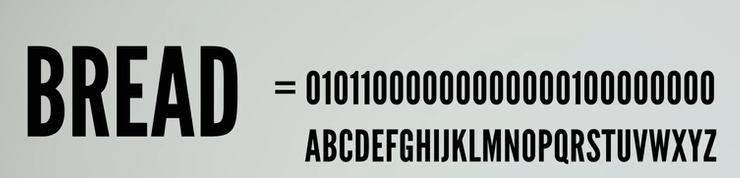

[word list](https://github.com/dwyl/english-words)
大量有意義單字的txt文件

### 問題

[five five-letter words with twenty-five unique letters](https://www.youtube.com/watch?v=_-AfhLQfb6w)
找出五個由五個字符組成的單字，其中25的字符皆不相同的組合
[參考解答](https://github.com/phire/five_clique/blob/main/cliques.csv)共813組

### 解法

改成逐字比較，如果前面的字已經有相
[Maximum disjoint set](https://en.wikipedia.org/wiki/Maximum_disjoint_set)
簡單出暴的使用五個迴圈搜尋
複雜度為n`**`5,n = 22950，我跑了一個多小時沒結果
PS.官方說要1個月

900 秒用 pyhon
15 秒用 Jave
同字母的話，直接放棄後面比較

[Someone improved my code by 40,832,277,770%](https://www.youtube.com/watch?v=c33AZBnRHks)
後續影片

- 利用英文字符出現頻率不同的特性，字頻較低的先搜尋

- 線程
- 將字母組成集合，只先搜最少用的集合
- Algorithm X
- 五個字符用字母順序用字母順序轉成整數
  

> 'etaoinshrdlcumwfgypbvkjxqz' 該字典的統計結果

### 原始問題

The Jotto Problem 技術報告上，未使用電腦
可以用 Dancing Link 論文解決問題
