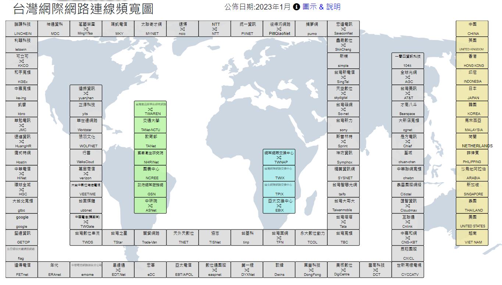

練習路由交換的網路系統
[stuin](https://stuin.net/)
[STUIX](https://stuix.io/)

### TWNIC

[台灣網際網路連線頻寬圖](https://map.twnic.tw/)

[Submarine Cable Map](https://www.submarinecablemap.com/)
全球海纜地圖

[cjdns](https://github.com/cjdelisle/cjdns)

> Cjdns 利用加密的IPv6及公鑰加密來分配網路地址並利用 Distributed Hash Table 逕行路由。它能提供近似零配置網路（Zero-Configuration Networking），並且能防範在現有網路中存在的很多和安全、可擴展性相關的問題
> 重新設計的 IP 層
