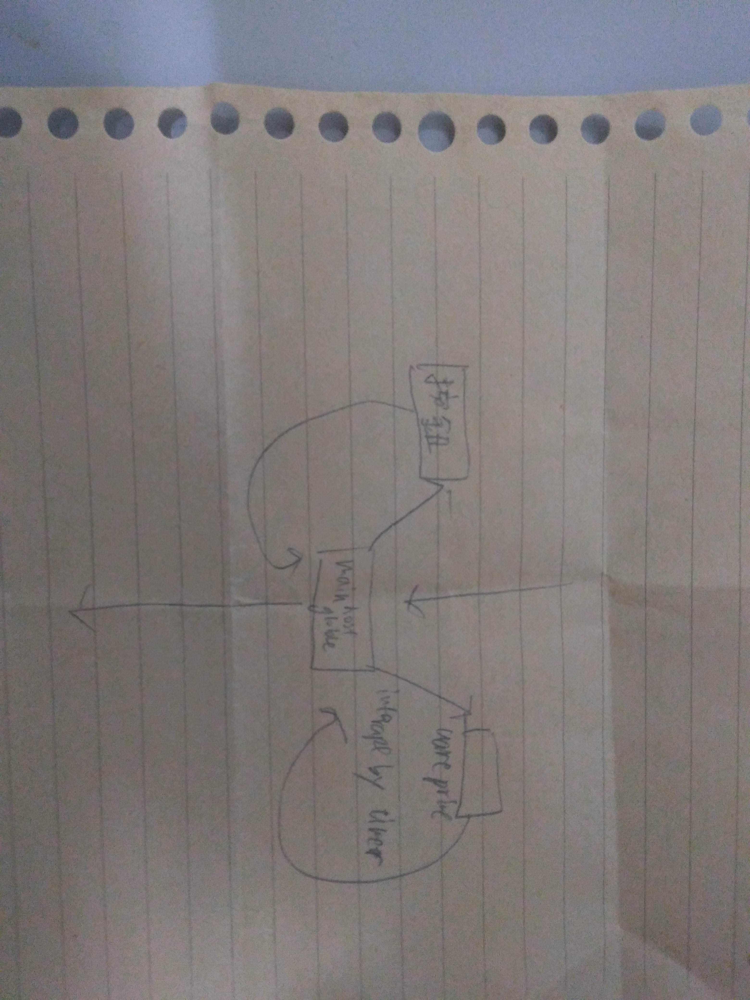
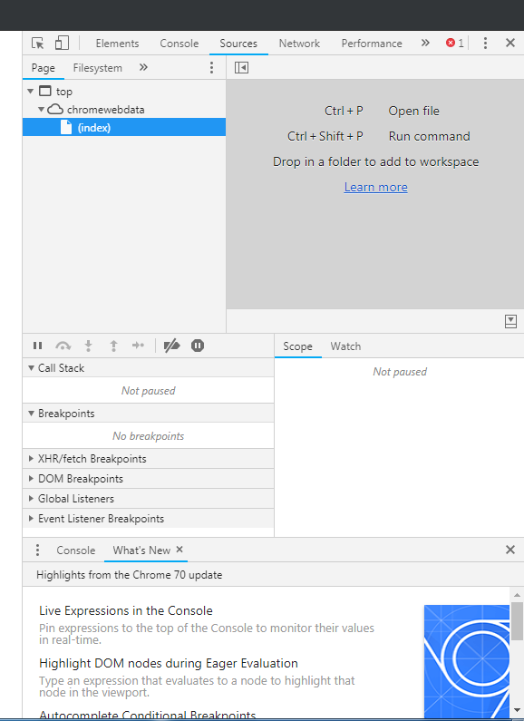
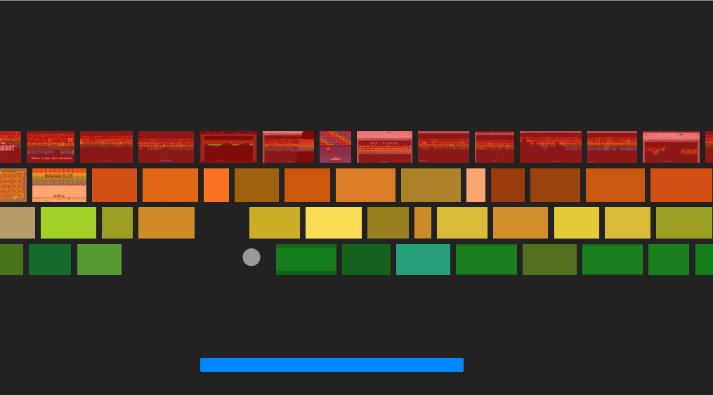

## target

我相信你們大家多看過
chrome://dino/

就復刻一個，應該會在uart上，但RJ-433的2.5mb/s讓人恐懼
如果寫不上去就去LCD(應該是兩個點)，計分會用七段顯示器。
蹲下可以，腳不會動。

## 元件

timer,鋒鳴器，uart,按鈕，七段顯示器

## 程式結構!



## 流程

```flow
st=>start :刻元件介面
e=>end: debug
op=>operation:  lowlevel print function(緩衝區，分頁選擇器，協議)
op2=>operation: 顯示api
op1=>operation: main
c0=condition:耦合測試
st->op->op2->po1->c0
c0(fail)->st
c0(pass)->e
```

這是時間跟達成率的關西 **[e^x + cos(x)](https://www.wolframalpha.com/input/?i=e%5Ex%2Bcosx)**

我原本想做弊，結果他不是javastript QQ



search "Atari Breakout" in google  picture

如果我有空想重操舊業算算彈性碰撞的話，完全沒有實踐的想法。

> Java 是個很棒的語言
> 對 C++ 社群有非常大的貢獻
> 他收留了所有寫不好 C++ 的人
> 維持了 C++ 神聖中土上高貴住民的純粹血統


所以我去寫java
