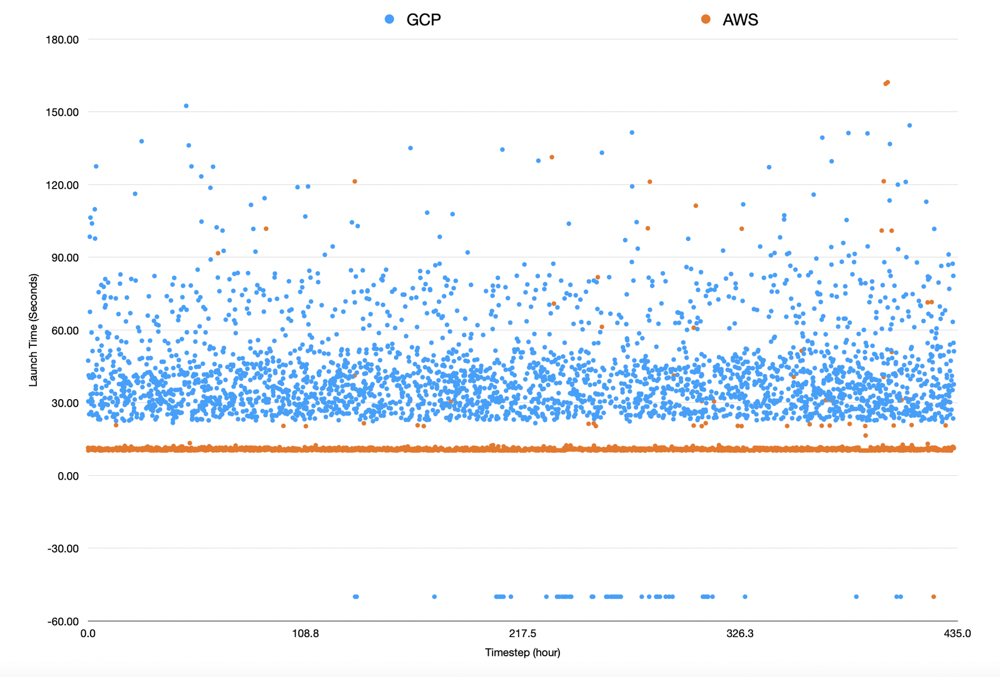

## [AWS vs GCP reliability is wildly different](https://freeman.vc/notes/aws-vs-gcp-reliability-is-wildly-different)

一個很有錢的研究者一直去AWS和GCP開機器(T4 GPU 實例)，比較他們機器開啟的成功率跟耗時

AWS(平均15秒)明顯快及穩定GCP(平均45秒)許多，AWS失敗次數也少很多。

## [Root cause chronicles: connection collapse](https://www.cncf.io/blog/2024/01/12/root-cause-chronicles-connection-collapse/)

應為 mysql 連線池預設值過小（30）且 移除未使用的連線的時間過長，導致部後端元件無法連至 mysql 導致超時

## [How an empty S3 bucket can make your AWS bill explode](https://medium.com/@maciej.pocwierz/how-an-empty-s3-bucket-can-make-your-aws-bill-explode-934a383cb8b1)

202405 AWS 會對錯誤的 S3 請求收費，但 S3 ID 是全球唯一的且可能洩漏，或因為資料公開存取等原因公開，該文章描述應一個特殊的 S3 ID 被某備份程式作為預設 ID 而導致巨額收費，且 AWS 沒打算解

## CDN 低機率憑證送錯

如果使用 CloudFront 或 ALB 的 CDN 都有低機率憑證送錯，鄙公司已經遇到三次了(202502)

## OpenAi  Kubernetes 控制面板超載導致連鎖故障

OpenAI 在全球運行數百個 Kubernetes 叢集 (cluster)
2024-12-11 我們部署了一個新的 telemetry 服務，以收集 Kubernetes 控制面板的詳細指標，新服務的配置意外導致每個叢集中的每個節點 (node) 執行高成本的 Kubernetes API 操作，且該成本會隨著叢集規模增長。由於數千個節點同時執行這些操作，Kubernetes API 伺服器 (server) 變得不堪負荷，導致大多數大型叢集的 Kubernetes 控制面板宕機
簡而言之，根本原因是一項新的 telemetry 服務配置意外產生了大規模 Kubernetes API 負載，導致控制面板超載，並破壞了基於 DNS 的服務發現機制 (service discovery)
