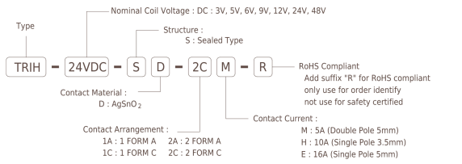
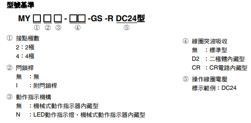
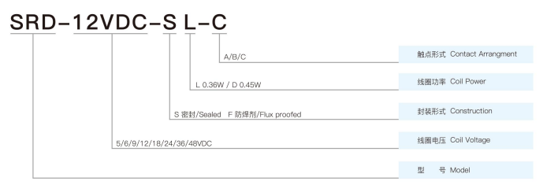

繼電器
由 Coil 的電壓決定 COM 跟 NO 或 NC 導通

## Pin

- 線圈（Coil）
- COM（Common）表示共接點
- NO（Normally Open）表示常開接點（俗稱A接點）。平常處於開路（斷路），線圈通電後才成為閉路（與共接點COM接通）
- NC（Normally Closed）表示常閉接點（俗稱B接點）。平常處於閉路（與共接點COM接通），線圈通電後才成為開路（斷路）

I, Wasami007, CC BY-SA 2.5, https://commons.wikimedia.org/w/index.php?curid=2431299

## Vendor

- OJE-SS-112HMF
  TE Con​​nectivity（美國廠），OJE-SS-1XXHMF, XX 代表線圈的驅動電壓有,05,12,24V
  Rated Voltage 30 VDC, 250VAC
  Rated Current 3 to 10A
- TTi TRIH-24VDC-SD-2CM-R
  Techtronic Industries Company Limited（香港廠）
  
  不同型號線圈的驅動電壓不同
- MY-GS
  Omron（日本廠）動作及歸復時間接在 20 毫秒以下
  
  不同型號線圈的驅動電壓不同
- Rayex  LEG-12
  瑞鎰電機，台廠，LEG-XX，XX 代表線圈的驅動電壓 3,5,6,9,12,24,48V
  Rated Voltage 24 VDC, 240VAC
  Rated Current 5A
- SRD-05VDC-SL-C
  宁波松乐继电器有限公司（SONGLE RELAY）（中國廠）
  
  Rated Voltage 30 VDC, 250VAC
  Rated Current 10A
