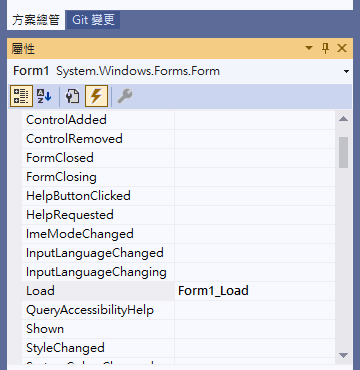

## Bind Event


一定要用設計窗口的屬性新增，不可以直接寫同名函數，不會綁定

## Require UAC

- 加入應用程式資訊清單
- 在應用程式資訊清單中將 requestedExecutionLevel 改為以下設定

```xml
<requestedExecutionLevel level="requireAdministrator" uiAccess="false" />
```

- 確定屬性 > 應用程式 > 程式資訊清單 指向加入的應用程式資訊清單

## Add Dll

- 將 dll 及其所需檔案利用 加入 > 現有項目 加入專案
- dll 的 屬性>建置動作 設定為內容，其他設為無
- 所有加入的檔案 屬性>複製到輸出目錄 設定為一律複製
- 用 DllImport 連結要使用的函式在 class 定義中

## DllImport

exposed by an unmanaged dynamic-link library (DLL) as a static entry point

```c
[DllImport("WinIo64.dll", CallingConvention = CallingConvention.StdCall)]
public static extern bool GetPortVal(UInt16 PortAddr, ref UInt32 pPortVal, UInt16 Size);
```

ref UInt32 表示 `Uint32*`，呼叫時為 `GetPortVal(0x62, ref pPortVal, 1);`
屬性

- CharSet
  Indicates how to marshal string parameters to the method and controls name mangling
  - CharSet.Unicode
  - CharSet.Ansi
- EntryPoint = "MessageBox"
  dll 內函數的名子
- CallingConvention
  - CallingConvention.Cdecl
  - CallingConvention.Winapi
  - CallingConvention.StdCall

## AnyCPU

AnyCPU 的陷阱: 如果你将项目的目标平台设置为 AnyCPU，这并不能保证兼容性。 AnyCPU 会根据运行程序的系统选择 32 位或 64 位模式(即使在同意台機器上選擇不同的建置目標也會使位元模式改變)
請在 屬性 > 建置 > 目標平台 中修改

## Timer

- `System.Timers.Timer` 如果處裡函式的執行時間比計時器間隔還長會導致處裡函式被重入，默默地吞掉異常
- `System.Threading.Timer` 如果處裡函式的執行時間比計時器間隔還長會導致處裡函式被重入，不跟  UI 共用線程
- `System.Windows.Forms.Timer` 如果處裡函式的執行時間比計時器間隔還長會導致處裡函式被重入,他跟 UI 是同一個線程，會堵塞 UI，可以直接寫 UI 元件

不可以在 `System.Timers.Timer` 或 `System.Threading.Timer` 中存取UI 線程的物件，可能拋錯或無聲的線程終止

```c
private void SysTime1Sec_Elapsed(object stst) {
    if (Interlocked.Increment(ref ReentrancyLock) > 1) {
        return;
    }
    ...
    Interlocked.Exchange(ref ReentrancyLock, 0);
}
```

此方法可以保證 SysTime1Sec_Elapsed 不被重入

## DataGridView 顏色不改變

若要使用特定值自訂單元格樣式，請實作 DataGridView.CellFormatting 事件的處理程序
datagridview 控制項存在一個問題，即在表單顯示之前無法更改任何單元格的顏色。因此，在呼叫 Shown() 之前運行的方法或觸發的事件將無法改變顏色
